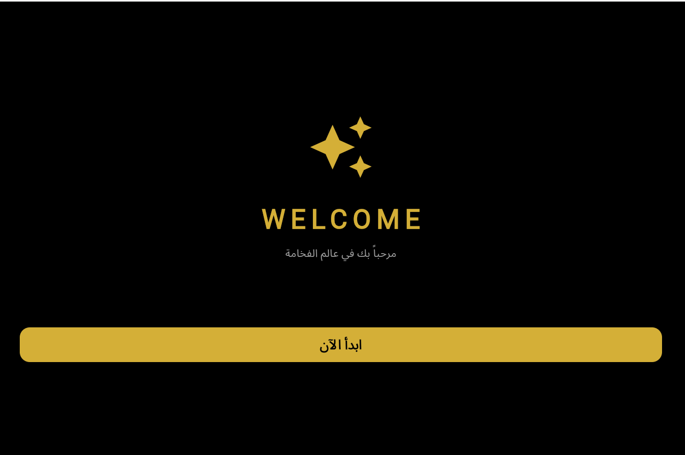
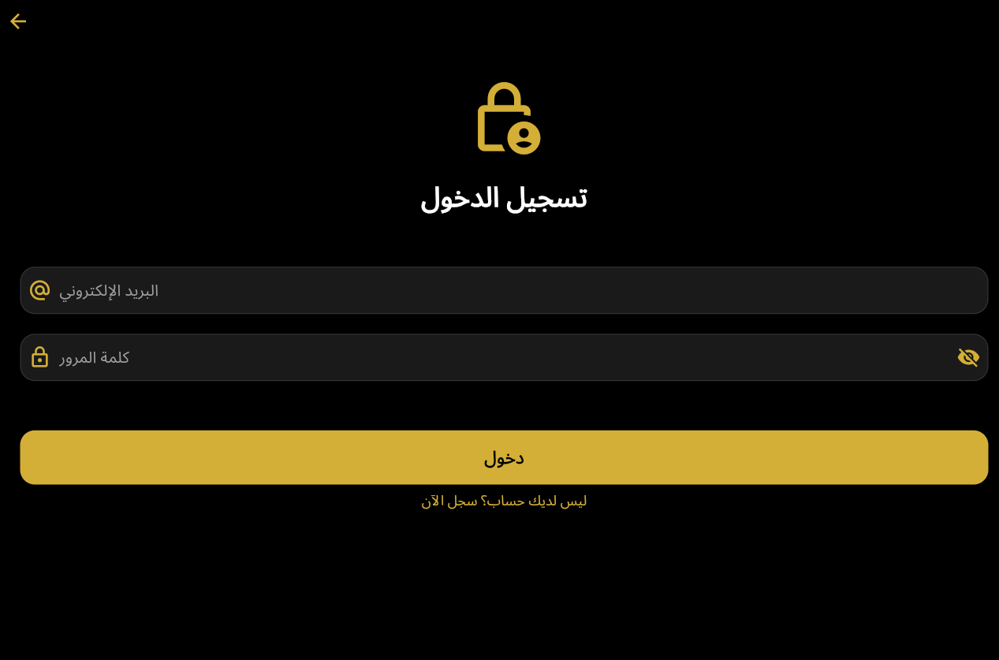
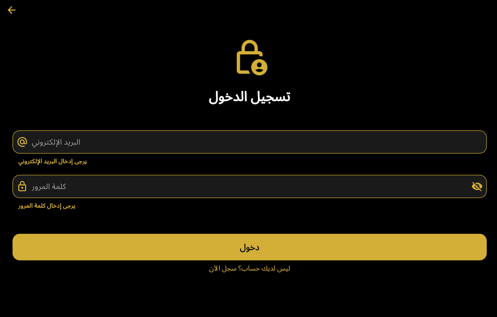
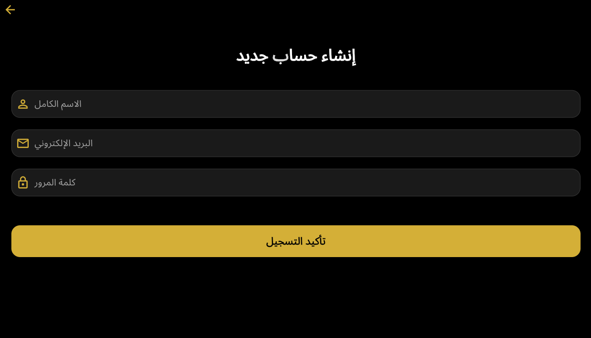
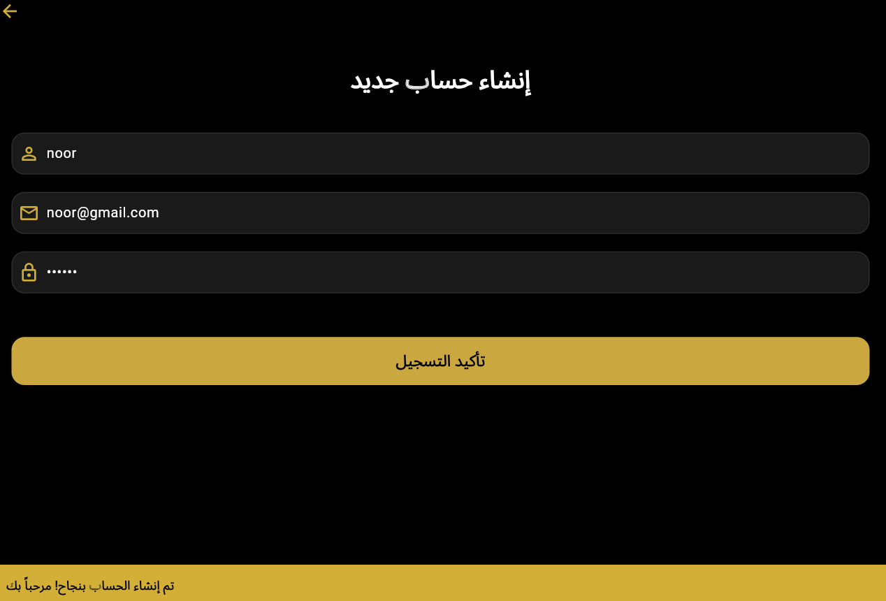

# 📱 Login App Architecture - Flutter Implementation

### 👤 Developer Profile
* **الاسم:** نور زكريا أحمد
* **التخصص:** تقنية المعلومات (IT)
* **المستوى:** الثالث (Level 3)

---

## 🏛 نظرة عامة (Architecture Overview)
مشروع تقني متخصص يهدف إلى بناء وتأمين أنظمة واجهات الدخول، تم تنفيذه باستخدام **Flutter Framework**. يركز التطبيق على معالجة الـ **Data Validation** وإدارة تدفق المستخدم (**User Flow Management**) لضمان تجربة مستخدم آمنة واستجابة نظام عالية الكفاءة بنمط الـ (Dark & Gold Design).

---

## 🛠 الجوانب البرمجية المنفذة (Technical Implementation)

* **Form Validation Logic:** بناء دوال منطقية متقدمة لفحص سلامة المدخلات (Email/Password) ومنع الثغرات الناتجة عن الحقول الفارغة أو الصيغ الخاطئة.
* **Authentication Flow:** إدارة عمليات الانتقال بين واجهة الترحيب، الدخول، وإنشاء الحساب باستخدام الـ `Navigator API` مع الحفاظ على استقرار مكدس الواجهات.
* **Dynamic UI States:** التحكم في حالة الحقول برمجياً (State Management) مثل إظهار وإخفاء كلمات المرور لحظياً باستخدام `setState`.
* **Instant Feedback System:** توظيف الـ `ScaffoldMessenger` لتقديم تغذية راجعة فورية عبر `SnackBars` مخصصة تخبر المستخدم بنجاح العمليات.

---

## 📸 التوثيق المرئي للمخرجات (System Screenshots)

### 01. نقطة الدخول (Entry Point - Welcome)

> **Technical Note:** واجهة ترحيبية مصممة باستخدام `Column` و `ElevatedButton` مع التركيز على الـ Visual Hierarchy للهوية البصرية.

### 02. واجهة الدخول وفحص البيانات (Core Authentication)

> **Technical Note:** استخدام `GlobalKey<FormState>` للتحقق من صحة البيانات (Validators) قبل السماح بعملية تسجيل الدخول.

### 03. تسجيل الحساب واستجابة النظام (Action Confirmation)

> **Technical Note:** توضيح لآلية عمل الـ `SnackBar` البرمجية التي تظهر كرسالة تأكيد ذهبية فور نجاح التحقق من البيانات المسجلة.

---

## 💻 بيئة العمل (Tech Stack)
* **Language:** Dart 3.3+
* **Environment:** VS Code / Flutter SDK
* **Design Pattern:** Material Design (Luxury Black & Gold Style)

---
*تم إعداد هذا المستند التقني كجزء من متطلبات التقييم لمادة تطبيقات الموبايل.*